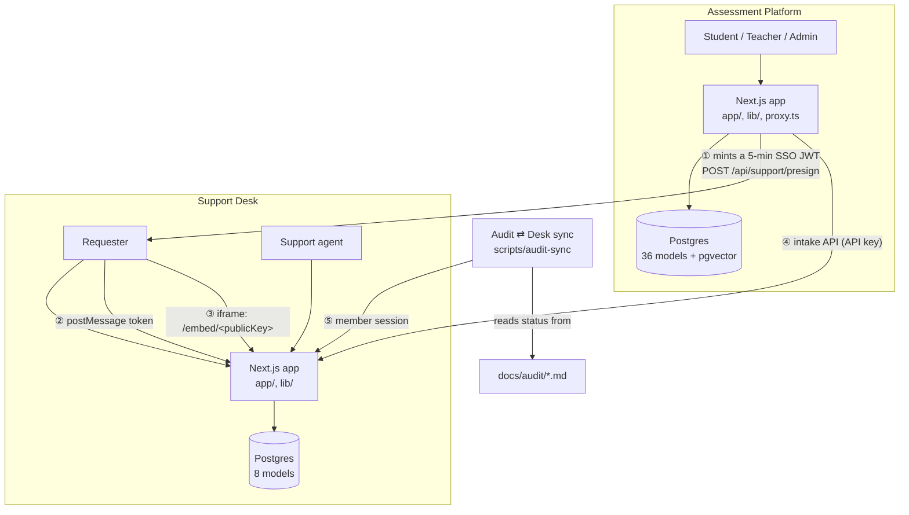
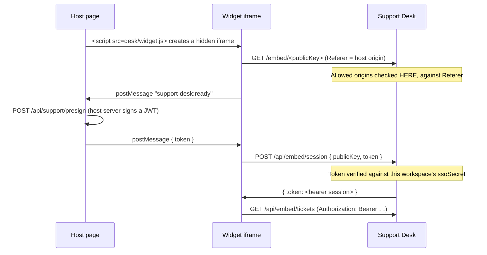

# System Design — Assessment Platform & Support Desk

How the two services work, what each owns, and how they connect.

This describes the system **as built** unless a section says otherwise. Where something
is planned rather than present, it is marked **[planned]** with the phase it lands in,
and the support desk's phases are defined in its own `docs/workbook.md`. That
distinction is deliberate: an architecture document that describes intent as fact is
worse than no document, because a builder plans against it.

---

## 0. How to read this

| Part                       | Covers                                               | Read it if you are                      |
| -------------------------- | ---------------------------------------------------- | --------------------------------------- |
| **1. The system**          | Why there are two services, the boundary, trust      | New to the codebase                     |
| **2. Assessment Platform** | The host application                                 | Working on teaching, grading, analytics |
| **3. Support Desk**        | The ticketing service                                | Working on tickets, the widget, intake  |
| **4. Integration**         | The three contracts between them                     | Wiring a host, or debugging an embed    |
| **5. Cross-cutting**       | Security, observability, testing, config, deployment | Operating either service                |
| **6. Gaps**                | What is missing, honestly                            | Planning work                           |

Companion documents: `support-desk/docs/operating-model.md` (the rules a support desk
must follow) and `support-desk/docs/workbook.md` (how to build them).

---

# Part 1 — The system

## 1.1 Two services, one system

```
                    ┌──────────────────────────────────────────────┐
                    │            ASSESSMENT PLATFORM               │
                    │  (the host application — owns the domain)    │
                    │                                              │
   student ────────▶│  courses · assessments · submissions ·       │
   teacher ────────▶│  grades · analytics · code eval · groups     │
   admin ──────────▶│                                              │
                    │  own Postgres (36 models, pgvector)          │
                    └───────────────┬──────────────────────────────┘
                                    │
              HTTP only, three contracts (Part 4) — no shared database,
              no shared session, no shared code, no shared deploy
                                    │
                    ┌───────────────▼──────────────────────────────┐
                    │              SUPPORT DESK                    │
                    │  (the service — owns the conversation)       │
                    │                                              │
   requester ──────▶│  tickets · messages · SLA · machine intake   │
   agent ──────────▶│                                              │
                    │  own Postgres (8 models)                     │
                    └──────────────────────────────────────────────┘
```

Each service has **its own database, its own deploy, its own session mechanism and its
own release cadence.** Nothing is shared at the storage or code layer. The only coupling
is HTTP, and Part 4 specifies it.

## 1.2 Why two services

The obvious alternative — make support a feature of the assessment app — was considered
and rejected. Three reasons, in order of weight:

**1. The support desk is meant to outlive this host.** It is designed as a reusable
product, not a feature: nothing in it imports a host application, and a host integrates
by minting a token and adding a script tag. Folding it in would put support vocabulary
(`confidentiality-leak`, audit groups, `dupOf`) into a schema meant to serve any host,
and would mean the desk's release cadence is coupled to the assessment app's.

**2. The audiences and the data differ.** A support agent should not need repository
access to work a queue, and a queue worked by support staff should not contain security
findings. The assessment app's data is student academic records — the most sensitive
class of data either service holds. Keeping support conversations in a separate database
means a support bug cannot reach grades, and a grading bug cannot expose tickets.

**3. They fail differently and should fail independently.** If the assessment app is
deploying, support should stay up; a student reporting "my grade looks wrong" during a
release window is exactly when the desk matters most.

What this costs, stated plainly: **two databases to operate, two deploys, and an
integration to maintain.** That is a real tax and it is worth knowing it is deliberate.

## 1.3 System context



## 1.4 Trust boundaries

Four boundaries, each with exactly one control. Getting these confused is the origin of
most of the security defects found in this codebase.

| Boundary           | Crossing                                | Control                                                                   | Not the control                                             |
| ------------------ | --------------------------------------- | ------------------------------------------------------------------------- | ----------------------------------------------------------- |
| **Host → person**  | A signed token is handed to the browser | Short TTL (5 min), workspace-scoped claim, HMAC signature                 | The token is a _selector_; it authorises nothing on its own |
| **Person → desk**  | A token is exchanged for a session      | Verification against that workspace's `ssoSecret`                         | The `Origin` header — see §4.2                              |
| **Machine → desk** | An API call files a ticket              | A hashed API key, resolved to exactly one workspace                       | The workspace id in the request body                        |
| **Member → desk**  | Staff sign in and work the queue        | Password → signed cookie, plus membership re-read from the DB per request | The session contents                                        |

---

# Part 2 — Assessment Platform (the host)

The larger of the two services and the one that owns the domain. Everything in this
part is built.

## 2.1 Purpose and domain

A university assessment platform: courses, assessments, submissions, grading, code
evaluation, group projects, and the analytics a teacher needs to act on them.

The domain's central scoping entity is the **`CourseOffering`** — a course taught to a
class by a teacher in a term. Almost everything hangs off it, and scoping to it is how
the application answers "who may see this".

## 2.2 Stack and runtime

| Concern        | Choice                                                 | Notes                                                                                    |
| -------------- | ------------------------------------------------------ | ---------------------------------------------------------------------------------------- |
| Framework      | Next.js **16.3.0**, App Router, RSC-first              | Turbopack in dev                                                                         |
| Language       | TypeScript, strict                                     | No suppressions permitted                                                                |
| Database       | PostgreSQL + **pgvector**                              | Vector column is `Unsupported("vector(1536)")`, read/written via raw SQL in `lib/vector` |
| ORM            | Prisma **7.9.1**                                       | `prisma-client` generator → `lib/generated/prisma`                                       |
| Validation     | zod **4**                                              | Contracts in `lib/contracts/`                                                            |
| UI             | React 19 + **Base UI** (`@base-ui/react`) + Tailwind 4 | shadcn-style, "base-nova"                                                                |
| Auth           | Home-grown HMAC cookie                                 | See §2.4                                                                                 |
| Tests          | Vitest 4                                               | Node env, serial, real Postgres                                                          |
| **Middleware** | `proxy.ts` at the repo root                            | Next 16 renamed Middleware to Proxy                                                      |

**`proxy.ts`, not `middleware.ts`.** Next 16 renamed the file. It does two things and is
_not_ the authorization boundary: it emits an `http.request` log line for `/api/**` and
performs optimistic role redirects for pages. Real authorization happens in the route or
page, against the database.

## 2.3 Layering

```
┌───────────────────────────────────────────────────────────────┐
│ app/          Pages (RSC) and API routes                       │
│   47 teacher routes · 16 student · 3 gradebook · 5 auth ·      │
│   2 admin · 1 health · 1 quiz · 1 support          ≈ 76 total   │
├───────────────────────────────────────────────────────────────┤
│ lib/<domain>/  Domain services — the bulk of the logic         │
│   grading · rubric-grading · code-eval · quiz-attempts ·       │
│   quiz-generation · groups · analytics · lms-export ·          │
│   retention · observability · llm · vector                     │
├───────────────────────────────────────────────────────────────┤
│ lib/          Shared infrastructure: auth, authz, contracts,   │
│               prisma, api, format, labels                      │
├───────────────────────────────────────────────────────────────┤
│ prisma/       Schema and migrations                            │
└───────────────────────────────────────────────────────────────┘
```

The pattern each domain follows: **a pure view module** (`*-view.ts`, testable without a
database) beside **a service module** that does the I/O. `teacher-dashboard-view.ts`,
`student-dashboard-view.ts`, `teacher-submissions-view.ts`, `lib/analytics/settings-view.ts`
and `lib/grading/policy-view.ts` are all pure and directly unit-tested.

## 2.4 Identity and authorization

**One session mechanism, three roles.**

```
cookie "auth-user" = base64url(payload) + "." + base64url(HMAC-SHA256(secret, payload))
payload = { id, email, role: "admin" | "teacher" | "student" }
TTL     = 7 days
```

- `lib/session.ts` owns signing, verification and the cookie contract. Verification is
  constant-time and every failure collapses to `null`, so a caller cannot distinguish
  tampered from expired.
- `lib/auth.ts` reads and writes the cookie.
- `SESSION_SECRET` is required in production; dev falls back to a documented constant.

**Authorization is two layers, and the second is not negotiable.**

1. `lib/authz.ts` → `requireUser()` / `requireRole(...)`. Cheap: verifies the signature,
   then the role.
2. `lib/authz-actor.ts` → `revalidateSessionActor(...)`. **Re-reads the actor from the
   database**, so a demoted or deleted user loses access inside a 30-second TTL rather
   than at cookie expiry. Failures are treated as unauthenticated (401), never cached.

```ts
// The canonical route shape, used by every API route:
const auth = await requireRole("teacher")
if (!auth.authorized) return auth.response
const parsed = await parseJsonBody(request, schema)
if (!parsed.ok) return parsed.response
const result = await someDomainService(auth.user, parsed.data) // does ownership
```

Object-level ownership is a third layer inside the service — `loadOwnedOffering` and
friends in `lib/groups/authz.ts` are the model. Sessions never carry ownership; it is
always re-read.

## 2.5 Tenancy and scoping

There is **no `Institution` model.** Scoping runs through the academic structure:

```
Course ──┬── CourseOffering ──┬── Enrollment (student ↔ offering)
         │        │           ├── Assessment ── Submission · Grade · Rubric
         │        │           ├── Material ── MaterialChunk (pgvector)
         │        │           └── Group ── GroupMember · PeerEvaluation · Milestone
         │        └── ClassRoom
         └── (catalogue: code, name, category, subtopicVocabulary)

User ──┬── StudentProfile   (registerNumber, formationProfile)
       └── StaffProfile     (empId)          ← names live here, not on User
```

Every read is scoped by `offeringId`, `courseId`, `classId` or `assessmentId`, or by the
actor's ownership. "Institution-wide" is represented by a `CalendarEvent` with all three
scope columns null — a convention, not a model, and the reason a stray unscoped row
becomes visible to every student (a defect this codebase has hit twice).

## 2.6 Data model

**36 models, 19 enums, 14 migrations.** Grouped by concern:

| Group                     | Models                                                                       |
| ------------------------- | ---------------------------------------------------------------------------- |
| **Identity**              | `User`, `StudentProfile`, `StaffProfile`                                     |
| **Catalogue & delivery**  | `Course`, `ClassRoom`, `CourseOffering`, `Enrollment`, `CourseRating`        |
| **Assessment**            | `Assessment`, `Submission`, `SubmissionVersion`, `Rubric`, `RubricCriterion` |
| **Grading**               | `Grade`, `GradeReview`, `AIGradeSuggestion`, `RetakeRequest`                 |
| **Quiz**                  | `Question`, `QuestionOption`, `QuizAttempt`, `QuizResponse`                  |
| **Code evaluation**       | `CodeTask`, `TestCase`, `TestRun`, `SimilarityCheck`                         |
| **Groups**                | `Group`, `GroupMember`, `PeerEvaluation`, `ContributionEvent`, `Milestone`   |
| **Materials & retrieval** | `Material`, `MaterialChunk` (pgvector)                                       |
| **Calendar**              | `CalendarEvent`                                                              |
| **LTI**                   | `LtiRegistration`, `LtiUserMapping`                                          |
| **Governance**            | `AuditLog`                                                                   |

Two conventions worth knowing:

- **No `@@map` anywhere.** Tables are PascalCase (`"User"`), columns camelCase and
  quoted in raw SQL.
- **`AuditLog` stores actor as plain id + role, not a foreign key**, so the log survives
  the deletion of the user it names. Entries are written inside the caller's transaction
  by `lib/grading/audit.ts → writeAuditLog`, with dotted action names.

## 2.7 Domain subsystems

| Subsystem            | Purpose                                                  | Notable design                                                                                                                                 |
| -------------------- | -------------------------------------------------------- | ---------------------------------------------------------------------------------------------------------------------------------------------- |
| `lib/grading`        | Grading policy, bands, review workflow                   | Offers a `partialUpdate()` helper (`lib/partial-update.ts`) because a whole-config PUT kept dropping fields — enforced by a custom ESLint rule |
| `lib/rubric-grading` | AI-assisted rubric evaluation and a teacher review queue | AI suggestion → accept/override/reject, with full provenance on `AIGradeSuggestion`                                                            |
| `lib/quiz-*`         | Question generation, attempt lifecycle, scoring          | Deterministic scoring; generation points distributed so questions sum to `maxMarks`                                                            |
| `lib/code-eval`      | Sandboxed code runs                                      | **Docker CLI**, spawned with `stdio: pipe`; results in `TestRun`                                                                               |
| `lib/groups`         | Project teams, peer evaluation, milestones               | CATME-style peer ratings                                                                                                                       |
| `lib/analytics`      | Cohort trends, item analysis, at-risk, thresholds        | Pure `*-view.ts` modules beside the service                                                                                                    |
| `lib/lms-export`     | CSV / OneRoster / LTI 1.3 export                         | Weighted final grades, with `incomplete` flagged                                                                                               |
| `lib/retention`      | Retention and redaction                                  | See §2.9                                                                                                                                       |

## 2.8 AI subsystem

One provider abstraction, five implementations, used by four features.

```
lib/llm/
  index.ts        createLlmProvider · getLlmProvider · getEmbeddingsProvider
  providers/      mock · openai-compatible · deepseek · anthropic · ollama
  observability.ts  emits an llm.generate / llm.embed line per call
  types.ts        LlmProvider · LlmGenerationProvider · LlmEmbeddingProvider
```

- **Generation and embeddings are separately selectable.** `EMBEDDINGS_PROVIDER` defaults
  to `LLM_PROVIDER`. This matters because DeepSeek exposes no embeddings route.
- **`mock` is the default**, so a missing or misspelled `LLM_PROVIDER` degrades to an
  offline deterministic provider instead of reaching the network. CI forces it.
- **Every call carries a `task` tag** (`quiz-generation`, `rubric-grading`, `code-grading`,
  `code-eval`, `embedding`, `general`) used for telemetry and explainability.
- **Provenance is persisted**: model, prompt version, token usage and latency are stored
  alongside the artefact they produced (`AIGradeSuggestion`, and the desk's `Ticket.triage`).
- Callers accept an injectable `deps.provider`, which is how tests exercise prompts and
  parsers without a network call.

## 2.9 Retention

**The purge is run-to-completion, and there is no worker.**

`docs/privacy/retention-policy.md` states it: the project has **no always-on worker and
no scheduler dependency**, so `scripts/retention-purge.ts` is an operator-scheduled
command (`npm run retention:purge`, intended as a daily cron).

- **Redact, never delete.** Content columns are nulled and `purgedAt` stamped; the row
  survives so metrics outlive the content.
- **Idempotent** — every write is scoped to `purgedAt: null`.
- **Dry-run by default** at every entry point, so an operator must opt in to mutating.

Seven entities carry `purgedAt`: `CourseRating`, `Submission`, `AIGradeSuggestion`,
`QuizResponse`, `TestRun`, `PeerEvaluation`, `SubmissionVersion`.

## 2.10 Observability

This is the host's strongest operational area, and the desk should copy it.

| Concern            | Where                                    | Behaviour                                                                                                                                                                                         |
| ------------------ | ---------------------------------------- | ------------------------------------------------------------------------------------------------------------------------------------------------------------------------------------------------- |
| Structured logging | `lib/observability/logger.ts`            | Level-gated JSON lines; `getProcessLogger()` singleton                                                                                                                                            |
| Request logging    | `lib/observability/http.ts` + `proxy.ts` | `http.request` per API call, `http.response` with status and duration                                                                                                                             |
| Redaction          | `lib/observability/redact.ts`            | Key-based **and** URL-based; never throws, never mutates; token _counts_ deliberately not redacted                                                                                                |
| Audit view         | `lib/observability/audit-view.ts`        | Teacher-facing reader over `AuditLog`                                                                                                                                                             |
| Health             | `app/api/health/route.ts`                | 200/503; reports app liveness, DB reachability with a timeout, and configured LLM modes. **Never returns the connection string, the raw provider value, a DB error message or a filesystem path** |

Route logging is opt-in via `withApiRoute`; `proxy.ts` covers the rest.

## 2.11 Rendering and the mockup tree

The app carries a parallel `/mockup` tree — a static design reference sharing the same
component vocabulary. `components/shell/nav-config.ts` is a single source of truth for
both, with `appOnly: true` marking items that exist only in the real app.

Consequences worth knowing:

- **Navigation is guarded by a test** (`tests/nav-scope.test.ts`) that asserts every nav
  href resolves to a real page. Adding a nav entry without a page fails CI.
- The nav is the app's structure made explicit, so a page that is not reachable from it
  is usually a mistake.

## 2.12 Testing

| Concern     | Choice                                                                   |
| ----------- | ------------------------------------------------------------------------ |
| Framework   | Vitest 4, node environment                                               |
| Location    | `tests/**/*.test.ts` (flat, kebab-case feature prefixes)                 |
| Database    | `TEST_DATABASE_URL`, name **must contain "test"** or the harness refuses |
| Migrations  | `prisma migrate deploy` — never `reset`/`dev`                            |
| Parallelism | `fileParallelism: false` — one shared database                           |
| Provider    | `LLM_PROVIDER=mock` forced in setup, so no test reaches the network      |

The recurring convention is a **route-auth test** per feature: mock the service, then
assert 401 and 403 _before_ the service is called. `tests/retention-route-auth.test.ts` is
the template. This is why the authority boundary is the best-tested part of either service
— and the reason the desk's member-side `CLOSED` leak went unnoticed for so long is that
the same convention had not been applied there.

---

# Part 3 — Support Desk (the service)

The younger service. Its architecture is **partly built and partly specified**, and the
two must not be confused — so this part marks every planned item.

## 3.1 Purpose

A support desk that makes a promise about response and keeps it. Tickets, conversations,
service levels, escalation, and machine filing. Its rules are specified in
`docs/operating-model.md`; its build plan is `docs/workbook.md`.

## 3.2 Stack and runtime

| Concern   | Choice                                               | Difference from the host                   |
| --------- | ---------------------------------------------------- | ------------------------------------------ |
| Framework | Next.js **16.3.5**                                   | Patch ahead of the host (16.3.0)           |
| Database  | **Its own** PostgreSQL, 8 models                     | Completely separate                        |
| ORM       | Prisma 7.10.0                                        |                                            |
| Auth      | HMAC cookie (members) + HMAC bearer token (contacts) | Two session kinds, not one                 |
| Dev port  | **4300**                                             | The host is 3000, so both run side by side |
| Tests     | Vitest, **62 passing**                               |                                            |

**Stateless by intent, with one current violation.** The app process must hold no
authoritative state, which is what makes horizontal scaling possible. Today the login
throttle (`lib/login-rate-limit.ts`) is an in-process `Map`, so a multi-instance deploy
multiplies the effective limit by the instance count. **[planned: P1]** moves it to a
shared store.

## 3.3 Layering

**Built** — the same shape as the host:

```
app/                     17 API routes, 6 pages
lib/support/             tickets · contacts · triage · sla · refs · view · workspaces · embed
lib/integration/         sso · api-keys · origins
lib/llm/                 index · mock · openai-compatible
lib/                     auth · authz · session · api · contracts · labels · page-auth · prisma
```

**[planned]** — the workbook's stricter split, which the current code does not yet follow:

```
lib/policy/    PURE. No DB, no clock, no fetch. Returns a decision + a reason.
               priority · lifecycle · sla · routing · breach · dedup
lib/engine/    Loads inputs, calls policy, writes in a transaction.
               tickets · lifecycle · assignment · escalation · incidents · intake ·
               rules · notify · knowledge · reporting
```

The commitment is **"policy is pure; effects are transactional."** Every decision is a
pure function over explicit inputs; services load the inputs and write the result. That is
what will make the operating model's invariants testable without a database, and what
makes a routing decision _explainable_ — the routing policy returns not just a team but
why it chose it.

## 3.4 Three kinds of principal

The most important distinction in the service, because confusing them is how authority
leaks.

| Principal   | Stored in                    | Authenticated by                    | Lifetime     | May                         |
| ----------- | ---------------------------- | ----------------------------------- | ------------ | --------------------------- |
| **Member**  | `Member` + `Membership`      | Password → signed cookie            | 7 days       | Work queues, per role       |
| **Contact** | `Contact`                    | Host SSO token → **bearer** session | 12 hours     | File, read own, reply, rate |
| **Service** | **[planned]** `ServiceToken` | Bearer token with **scopes**        | Configurable | Exactly its scopes          |

**Roles** are `OWNER · ADMIN · AGENT · VIEWER`, assigned **per membership** — a junction
row carrying the role, not a column on the account. One person can therefore be an `AGENT`
in one workspace and a `VIEWER` in another, and revoking access is a delete rather than an
edit. **[planned: P3]** adds `LEAD`, because hierarchical escalation needs a rung between
agent and admin.

**The service principal does not exist yet**, and that is a real gap rather than a
footnote. Today the only machine credential is the intake API key, which can file a ticket
and nothing else — so anything else a machine needs borrows a **human member account**.
Our own audit sync does exactly that (email + password), which means its authority is
whatever its role grants rather than what its task needs.

## 3.5 Tenancy and identity

**Scope key: `workspaceId`.** One workspace = one host application, or one brand inside it.

- A **contact session is minted per workspace**, and the workspace is read from the
  session — never from a request parameter. There is no id a caller can substitute to
  reach another tenant.
- An **API key belongs to exactly one workspace**, and the intake path reads the workspace
  from the key, never from the body.
- A **member may belong to many workspaces**, with a different role in each.

**Contact identity is the subtle part.** A host user is recognised by
`(workspaceId, externalId)`, where `externalId` is the host's **own user id**. Getting
this wrong does not merely fail to match — it silently creates a _second_ contact for one
human, and the widget then shows that empty contact's tickets while the real ones sit in
the queue looking identical. This happened during development and was fixed in `acfc26a`.

## 3.6 Data model

**8 models, 6 enums.**

```
Workspace ──┬── Membership ──── Member        the support team, per-workspace roles
            ├── Contact                        end users, from host SSO
            ├── ApiKey                         machine access (intake only)
            └── Ticket ──┬── Message           the thread (+ AI provenance)
                         └── TicketEvent       append-only audit trail
```

Design decisions that are load-bearing:

- **`Ticket.context`, `contextLabel` and `Message.authorLabel` are snapshots, not live
  references.** A host may delete the entity a ticket refers to, and a foreign key that
  nulls out would silently change what the ticket appears to be about. A ticket must still
  read correctly after the thing it describes is gone.
- **Internal notes are filtered in the _query_, not in a serializer**
  (`getContactTicket`). Filtering at the view layer means a caller who forgets leaks them;
  filtering in the `where` clause means the data never leaves the database.
- **`Ticket.ref` is backed by a per-workspace counter** incremented in the same
  transaction as the insert, so two concurrent filings cannot collide.
- **API keys store only a SHA-256 hash.** These are long random values rather than
  user-chosen passwords, so there is no dictionary to attack and no need to be slow on a
  hot path.

**[planned]** — `Team`, `TeamScope`, `TeamMembership`, `SlaClock`, `SlaPolicy`,
`SlaTarget`, `BusinessCalendar`, `WorkingWindow`, `Holiday`, `Handoff`, `Incident`,
`Postmortem`, `PostmortemAction`, `Rule`, `RuleRun`, `SavedView`, `Notification`,
`Webhook`, `WebhookDelivery`, `ScheduledJob`, `ServiceToken`, `ReporterTrust`,
`KnowledgeArticle`, `Macro`, `TicketLink`, `Tag`, `Attachment`, `Approval`.

## 3.7 Lifecycle, priority and service levels

**Built:** five states (`NEW · OPEN · PENDING · RESOLVED · CLOSED`), four priorities
(`LOW · NORMAL · HIGH · URGENT`) settable by a filer, two SLA clocks stamped at creation
from constants, a first-response breach predicate, and CSAT capture.

Rules enforced today, with tests:

- Only a member resolves or closes. A requester reply on `PENDING` returns the ticket to
  `OPEN`; on `RESOLVED` it sets `awaitingTeamSince` and leaves the status alone; on
  `CLOSED` it is refused.
- **`CLOSED` is terminal** — a member cannot reply on a closed ticket or move it out of
  that state. Non-status edits are still allowed.
- Rating is refused until a member has resolved the ticket, and never transitions it.
- An internal note does not stop the first-response clock. A member reply does, once.
- The last owner cannot be demoted or removed; an assignee must be a member.

**[planned]** — the operating model's fuller machine: six states with `ON_HOLD`, priority
**derived** from impact × urgency rather than chosen freehand, `SlaClock` rows with pause
semantics and business-hours calendars, OLAs on every internal handoff, teams and routing,
functional vs hierarchical escalation, major-incident command, and the rules engine.

## 3.8 Machine filing

**Built:** an API-key-authenticated intake endpoint that files one ticket, with provenance
(`reporterLabel`, `externalRef`), optional AI triage, and a `source` that distinguishes a
person's report from a machine's.

**Why it matters here specifically:** a person files one ticket about one problem; a
machine files what it finds, at machine speed, and several agents may find the same thing.
During development a single careful import filed **129 tickets of which 5 were the same
defect reported twice** — so duplication is not hypothetical.

**[planned: P1]** deduplication on `externalRef`, per-reporter rate limiting, trust levels
(`OBSERVE · SUGGEST · ACT`), and a rule that **a machine may never set priority** — it may
only suggest, and a human confirms.

## 3.9 Docs as specification

Unusually for a codebase this size, the desk's rules are written down before most of them
are built:

- **`operating-model.md`** — what the rules are. Philosophy, lifecycle transition rules,
  priority derivation, service levels, routing and escalation, incident practice, machine
  filing, metrics, and the invariants the code must enforce.
- **`workbook.md`** — how to construct them. Architecture, a full permission matrix, a
  design per engine, interfaces, a nine-phase plan with acceptance criteria, and a
  traceability table marking each invariant implemented-and-tested, implemented-untested,
  or not built.

---

# Part 4 — Integration

Three contracts. Nothing else crosses between the services: no shared database, no shared
session, no shared code.

## 4.1 The contracts

| #   | Contract                    | Direction         | Authenticated by                        | Purpose                                        |
| --- | --------------------------- | ----------------- | --------------------------------------- | ---------------------------------------------- |
| ①   | `POST /api/support/presign` | host → host       | The host's own session                  | Mints a 5-minute identity token for the widget |
| ②   | iframe + `postMessage`      | browser ↔ browser | Origin allowlist + `postMessage` checks | Renders the widget and hands over the token    |
| ③   | `POST /api/intake/tickets`  | host → desk       | A workspace API key                     | Files a ticket with no human in the loop       |

## 4.2 The embed handshake, in detail



Two properties look redundant and are not. **Both were bugs before they were rules.**

**① The allowlist is enforced on the iframe navigation, not on the exchange.**

A widget's XHR is _same-origin with the desk_, so its `Origin` header is the desk's own
origin — never the embedding page's. Checking that against a list of host origins can only
ever fail, and it did: every embed was refused with _"This origin is not allowed to embed
the widget."_

The allowlist therefore does its work where the embedder is genuinely observable — the
iframe navigation, against the browser-set `Referer`, which a page cannot forge for a
frame it did not load. The exchange still rejects a cross-origin caller, but it no longer
pretends to be the embed control.

**② The contact session is a bearer token, not a cookie.**

A `SameSite=Lax` cookie is not sent inside a cross-site iframe, and `SameSite=None` is
blocked by Safari and Firefox. A cookie-only design would pass a same-site test and fail
for every real host. The token is returned in the exchange response, kept in memory by the
widget, and presented as `Authorization: Bearer`.

**Also deliberate:** the token travels by `postMessage`, never in the iframe URL, because a
URL leaks through history, `Referer` and screen-sharing. Both sides verify
`event.origin` **and** `event.source`, and neither ever posts to `'*'`.

## 4.3 Identity mapping

The host's presign endpoint sends its own `User.id` as the token's `externalId`:

```json
{
  "externalId": "demo-user-student-1",
  "workspaceId": "sd-workspace-demo",
  "email": "demo.student1@school.edu",
  "name": "Demo Student One",
  "iss": "support-desk",
  "aud": "support-desk"
}
```

**The host's user id is the contract.** Not a username, not an email, not an id invented
for the integration — because the desk upserts on `(workspaceId, externalId)`, and an
invented id silently creates a second person (§3.5).

The desk never stores a host password and never mirrors a host user table. It learns a
name and an email at the moment someone opens the widget, and nothing else.

## 4.4 The machine path, and the audit→ticket pipeline

The desk's intake API was built for machines, and this codebase uses it for real work: the
completeness audit's findings become tickets.

```
audit agents ─▶ docs/audit/*.md  (the report, authoritative for finding content)
                       │
                       │  npm run audit:import   (idempotent; records findingId as externalRef)
                       ▼
              support desk tickets  (authoritative for status)
                       │
                       │  npm run audit:sync     (three-way merge against a snapshot)
                       ▼
              status flows back into the markdown
```

Deliberately, the split is by **fact** rather than by record: the report owns a finding's
content (evidence, location, severity), the desk owns its status, assignee and discussion.
A support agent does not need repository access; a queue worked by support staff should not
contain `confidentiality-leak` findings.

Two properties the sync had to get right, both learned the hard way:

- **A three-way merge, not last-write-wins.** Both sides can change while the other is not
  looking, and last-write-wins would clobber the loser silently. Each run compares against a
  snapshot of the last agreed state; only genuine conflicts are reported, and they are
  resolved by recency **and printed**.
- **Duplicates must follow their canonical.** Five findings are the same defect filed by
  two audit groups, so resolving `TN-1` without propagating to `TN-31` would report one bug
  as simultaneously fixed and unfixed.

## 4.5 What is deliberately not shared

| Not shared        | Why                                                                                                             |
| ----------------- | --------------------------------------------------------------------------------------------------------------- |
| Database          | A support bug must not reach grades; a grading bug must not expose tickets                                      |
| Session mechanism | Different principals, different lifetimes, different authorities                                                |
| Code              | The desk must be deployable beside _any_ host; a shared package would couple the release cadences               |
| User table        | The desk needs a name and an email, not a mirror of an academic identity                                        |
| Secrets           | The desk's `ssoSecret` is per workspace and server-side only; the host's `SESSION_SECRET` never leaves the host |

---

# Part 5 — Cross-cutting

## 5.1 Security posture

| Control                  | Assessment Platform                      | Support Desk                                             |
| ------------------------ | ---------------------------------------- | -------------------------------------------------------- |
| Session                  | HMAC cookie, 7-day TTL                   | HMAC cookie (member) + bearer (contact)                  |
| Re-validation            | Actor re-read per request, 30s TTL       | Membership re-read per request                           |
| Passwords                | bcrypt                                   | bcrypt                                                   |
| Machine credentials      | —                                        | SHA-256 of a random key; plaintext once                  |
| Login throttling         | 10 / 15 min, in-process `Map`            | 10 / 15 min, in-process `Map` (both need a shared store) |
| Response envelope        | `{ success, message }`                   | `{ success, message }`                                   |
| Secret redaction in logs | Enforced (`lib/observability/redact.ts`) | **Absent** — no structured logger at all                 |

**Three classes of authority leak were found and fixed in this system, and the pattern is
worth remembering.** Each was a rule that was true of one path and assumed of another:

| Leak                                                       | How it slipped                                                                | Fix                                                |
| ---------------------------------------------------------- | ----------------------------------------------------------------------------- | -------------------------------------------------- |
| A member could reply on and reopen a `CLOSED` desk ticket  | Only the _requester_ path was guarded and tested; the member side was trusted | `isTerminalStatus` on both write paths (`2f043f5`) |
| A requester's reply on `PENDING` left the ticket stuck     | The resolved case was handled; the answered case was not                      | Return to `OPEN` on a `PENDING` reply (`3352559`)  |
| The embed's origin allowlist refused every legitimate host | The check was applied where the header could not carry the information        | Enforce on `Referer`, not `Origin` (`be51771`)     |

The common shape: **a rule enforced on the path someone thought about, and merely assumed on
the path nobody did.** That is why route-auth tests assert the _refusal_, not the success.

## 5.2 Observability — an asymmetry

The host has structured logging, request timing, a redaction layer and a health endpoint
that is careful not to leak. **The desk has none of it**: no logger, no request lines, no
health endpoint, and its `console.error` is the whole of its operational output.

That asymmetry is worth naming because it is not a small gap. The desk is the service that
receives machine volume and runs the slower, failure-prone work — SLA timers, queues,
escalations. **[planned: P1]** brings it up to the host's standard.

## 5.3 Testing

|                      | Assessment Platform                                            | Support Desk                      |
| -------------------- | -------------------------------------------------------------- | --------------------------------- |
| Framework            | Vitest 4, node env                                             | Vitest 4, node env                |
| Database             | `TEST_DATABASE_URL`, name must contain "test"                  | Same guard                        |
| Parallelism          | Serial (`fileParallelism: false`)                              | Serial                            |
| Network              | `LLM_PROVIDER=mock` forced                                     | Same                              |
| Signature convention | **Route-auth tests** asserting 401/403 before the service runs | **None yet** — see the note below |
| Suite size           | (largest)                                                      | **90 tests**                      |

**The desk has no route-level tests, and that has cost it.** Its four test files
(`error-envelope`, `tickets`, `queue-order`, `unit`) all exercise services and pure
functions directly; nothing drives a request through a route handler. Every one of the
three authority leaks found in the desk was a _route-level_ behaviour:

| Leak                                                       | Would a route test have caught it?                                            |
| ---------------------------------------------------------- | ----------------------------------------------------------------------------- |
| A member could reply on and reopen a `CLOSED` ticket       | Yes — `PATCH` and the replies route both accepted it                          |
| A requester's reply on `PENDING` left the ticket stuck     | Yes, though the service test would also have caught it — it was a service bug |
| The embed's origin allowlist refused every legitimate host | Yes — the exchange route returned 403                                         |

The host's convention exists precisely for this: assert the _refusal_ at the route, not
only the success at the service. The desk's suite was written against the rules
(`CLOSED is terminal`, `only the support team may resolve a ticket`) and proves them at the
service layer — necessary but not sufficient, because a route that forgets to call the
service is invisible to it. **[planned: P1]** adds the route-auth suite the host already
has; `workbook.md` §E3 specifies it as per-phase.

Both services treat a test as the proof of a _rule_, not of a code path — the desk's tests
are named after the operating-model rules they pin (`CLOSED is terminal`, `only the support
team may resolve a ticket`).

## 5.4 Configuration

| Variable    | Assessment Platform                                                                                       | Support Desk                                             |
| ----------- | --------------------------------------------------------------------------------------------------------- | -------------------------------------------------------- |
| Database    | `DATABASE_URL`                                                                                            | `DATABASE_URL`, `TEST_DATABASE_URL`                      |
| Session     | `SESSION_SECRET`                                                                                          | `SESSION_SECRET`                                         |
| LLM         | `LLM_PROVIDER`, `EMBEDDINGS_PROVIDER`, `DEEPSEEK_*`, `OPENAI_*`, …                                        | `LLM_PROVIDER`, `DEEPSEEK_*`                             |
| Integration | `SUPPORT_DESK_URL`, `SUPPORT_DESK_PUBLIC_KEY`, `SUPPORT_DESK_WORKSPACE_ID`, **`SUPPORT_DESK_SSO_SECRET`** | — (the secret is per workspace, stored in the desk's DB) |
| Audit sync  | `AUDIT_SYNC_DESK_URL`, `AUDIT_SYNC_DESK_EMAIL`, `AUDIT_SYNC_DESK_PASSWORD`, `AUDIT_SYNC_WORKSPACE`        | —                                                        |

**The desk protects itself from a whole class of mistake.** Every destructive database
script routes through `scripts/guard-db.ts`, which refuses any database not matching
`/support_desk/`. That guard is not theoretical: during development `prisma migrate dev`
resolved to the _assessment_ database, because `dotenv` never overrides an already-exported
`DATABASE_URL`, and only stopped because Prisma detected schema drift first.

The audit sync's member password is a **known limitation**, not a design: it should be a
scoped service token (§3.4).

## 5.5 Local development topology

| Service               | Port     | Command                         |
| --------------------- | -------- | ------------------------------- |
| Assessment Platform   | **3000** | `npm run dev`                   |
| Support Desk          | **4300** | `npm run dev`                   |
| Audit dashboard (SSE) | **4318** | `npm run audit:dashboard:serve` |

The two ports are separate so both apps run at once. The desk's seeded workspace allows
`http://localhost:3000` as an embed origin, which is what makes the widget work locally.

## 5.6 Deployment

|                       | Assessment Platform                 | Support Desk                         |
| --------------------- | ----------------------------------- | ------------------------------------ |
| Shape                 | One Next.js process + Postgres      | One Next.js process + Postgres       |
| State                 | Stateless except the throttle cache | Same                                 |
| Migrations            | `prisma migrate deploy` in CI       | Same, behind the DB guard            |
| Scheduled work        | External cron → `retention:purge`   | **[planned]** an in-table job worker |
| Statelessness blocker | In-process login throttle           | Same, plus the same                  |

Neither service has a background worker today. The host externalises its one scheduled job
to cron; the desk **[planned: P2]** needs a real worker because SLA breach detection, `CLOSED`
by rule, digests and notification retries cannot be cron-shaped.

---

# Part 6 — Known gaps

Honest, and ordered by weight.

## 6.1 Support Desk — the honest summary

The desk is a **working prototype with a complete specification**. Its authority boundary,
tenancy, embed handshake and intake path are built and tested. Most of its _operational_
machinery is specified and not built.

The workbook's own traceability table says it plainly: of the operating model's invariants,
**five are implemented and tested, five implemented without a direct test, and the
remainder are not built.**

| Missing                                | Consequence                                                          |
| -------------------------------------- | -------------------------------------------------------------------- |
| Teams and queues                       | Routing, escalation and OLAs have nothing to route _to_              |
| `ON_HOLD`, auto-close, pause semantics | The lifecycle cannot express "waiting on a vendor" or close itself   |
| Impact × urgency derivation            | Priority is chosen freehand, so it carries no meaning                |
| Business-hours calendars               | Business-hours SLAs across a weekend are a fiction                   |
| The job worker                         | SLA breach detection, auto-close, digests and retries are impossible |
| Notifications and email                | **The widget is the only way a requester sees a reply**              |
| Scoped service tokens                  | Machine integrations borrow a human account                          |
| Deduplication and trust levels         | Machine volume will duplicate and drown the queue                    |
| Observability                          | No logs, no health endpoint, no counters                             |
| Reporting                              | No metric set, no segmentation, no export                            |
| Inbound email                          | `EMAIL` exists as an enum value with no ingestion                    |
| Contact merge                          | The duplicate-identity defect has no recovery path                   |

## 6.2 Assessment Platform

| Gap                                        | Note                                                                    |
| ------------------------------------------ | ----------------------------------------------------------------------- |
| In-process login throttle                  | Multiplies the limit by the instance count                              |
| Retention has no worker                    | Deployment depends on an operator configuring cron                      |
| `AuditLog` actor is not a foreign key      | Deliberate (survives deletion) but means names are frozen at write time |
| The mockup tree duplicates route structure | A shared nav config mitigates, but drift is possible                    |

## 6.3 Both

| Gap                      | Note                                                                                                                 |
| ------------------------ | -------------------------------------------------------------------------------------------------------------------- |
| No cross-service tracing | A request id does not survive the hop from host to desk. `proxy.ts` mints one on the host; the desk does not read it |
| No shared contract tests | The three integration contracts are tested on each side, never against each other                                    |
| The sync's credential    | A human member account rather than a scoped token                                                                    |
| Multi-instance readiness | Both need a shared rate-limit store before more than one instance is safe                                            |

---

# Appendix A — Repository map

```
/Users/slade/Documents/Learning/GH/
├── Assessment-Dashboard/            the host  (:3000)
│   ├── app/                         (auth) · (dashboard) · (mockup-standalone) · api · mockup
│   ├── lib/                         ~50 domain and infrastructure modules
│   ├── prisma/                      36 models · 19 enums · 14 migrations
│   ├── components/                  shell/ + ui/ (Base UI)
│   ├── scripts/audit/               LangChain audit harness
│   ├── scripts/audit-dashboard/     live SSE dashboard
│   ├── scripts/audit-sync/          the three-way status merge
│   ├── docs/audit/                  the four audit reports (source of truth)
│   └── docs/architecture/           ← this document
└── support-desk/                    the service  (:4300)
    ├── app/                         (desk) · api · embed
    ├── lib/                         support/ · integration/ · llm/
    ├── prisma/                      8 models · 6 enums
    ├── public/widget.js             the zero-dependency loader
    ├── scripts/                     guard-db · smoke-embed · check-permissions · import
    └── docs/                        operating-model.md · workbook.md
```

# Appendix B — Endpoint map

**Assessment Platform**

| Group              | Count  | Examples                                                                                                |
| ------------------ | ------ | ------------------------------------------------------------------------------------------------------- |
| `teacher/`         | 47     | `analytics/`, `assessments/[id]/release`, `code-tasks/[id]/runs`, `groups/`, `reviews/`, `rubrics/[id]` |
| `student/`         | 16     | `assessments/[id]/submission`, `code-submissions/[runId]`, `quiz-attempts/practice`, `peer-evaluation`  |
| `auth/`            | 5      | `login`, `logout`, `me`, `register`, `seed`                                                             |
| `gradebook/`       | 3      | `assessments`, `marks`                                                                                  |
| `admin/`           | 2      | `retention/purge`, `dev/rebalance-offerings`                                                            |
| `support/`         | 1      | `presign` ← the integration                                                                             |
| `health/`, `quiz/` | 1 each |                                                                                                         |

**Support Desk**

| Group               | Count | Authenticated by            |
| ------------------- | ----- | --------------------------- |
| `workspaces/[ws]/…` | 7     | Member session + membership |
| `embed/…`           | 5     | Contact bearer session      |
| `auth/…`            | 3     | —                           |
| `intake/tickets`    | 1     | Workspace API key           |
| `workspaces`        | 1     | Member session              |

# Appendix C — Glossary

| Term                | Meaning                                                                           |
| ------------------- | --------------------------------------------------------------------------------- |
| **Contact**         | An end user of a host application, known to the desk only by host SSO             |
| **Member**          | Support staff; holds a membership with a role in a workspace                      |
| **Workspace**       | One tenant of the desk — one host application, or one brand                       |
| **Offering**        | A course taught to a class by a teacher in a term; the host's scoping unit        |
| **Principal**       | Anything that can act: member, contact, service                                   |
| **SSO token**       | The 5-minute JWT the host mints to identify a person to the widget                |
| **SLA / SLO / SLI** | Commitment / internal target / measurement                                        |
| **OLA**             | An internal handoff target between teams                                          |
| **FCR**             | First contact resolution                                                          |
| **`externalRef`**   | The filing system's own identifier for a record, used to reconcile two systems    |
| **Invariant**       | A rule the code must enforce; the desk's are numbered in `operating-model.md` §17 |
