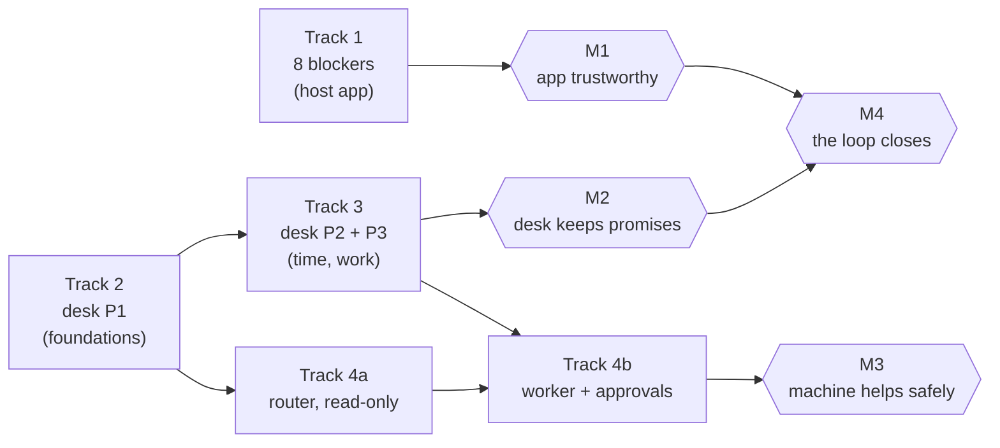

# Program Plan — Assessment Platform & Support Desk

What we are building, in what order, and what "done" means.

Written after the first full audit of the system: 20 agents, 129 findings, and a complete
operating model plus a nine-phase desk plan. This document exists because those artefacts
describe _the pieces_ and nothing described _the programme_ — in particular, the audit found
**8 distinct blocking defects** that no plan had assigned to anyone.

Companion documents:

| Document                               | Where     | What it is                                     |
| -------------------------------------- | --------- | ---------------------------------------------- |
| `docs/architecture/system-design.md`   | this repo | How the two services work together             |
| `docs/audit/README.md` + four reports  | this repo | The audit: schema, findings, comparison        |
| `support-desk/docs/operating-model.md` | desk      | The rules a support desk must follow           |
| `support-desk/docs/workbook.md`        | desk      | How to build them — 9 phases                   |
| `support-desk/docs/agent-*.md`         | desk      | The autonomous agent's requirements and design |

---

## 1. Where we are

Three workstreams, at very different stages. Stating them plainly, because the plan's shape
follows from the unevenness.

| Workstream             | State                                                                                                                                                                         | Evidence                    |
| ---------------------- | ----------------------------------------------------------------------------------------------------------------------------------------------------------------------------- | --------------------------- |
| **The app** (host)     | **Works, with defects.** 36 models, 76 API routes, in daily use as a demo. An audit found 129 issues, 125 still open, including **8 distinct blockers**                       | `docs/audit/aggregate.json` |
| **The desk** (service) | **Prototype with a complete spec.** The authority boundary, tenancy, embed and intake are built and tested (109 tests). Most operational machinery is specified and not built | `workbook.md` Appendix 3    |
| **The agent**          | **Designed, not built.** 16 decisions made, two documents written. No code                                                                                                    | `agent-architecture.md`     |

**The asymmetry that matters:** the design is now deeper than the implementation. That is a
good position to be in _deliberately_ and a bad one to stay in _accidentally_. The plan below
closes it in a specific order rather than adding more specification.

### 1.1 The number that should drive priority

The desk's own traceability table counts the operating model's invariants:

|                                   | Count |
| --------------------------------- | ----- |
| Implemented **and** tested        | 5     |
| Implemented, no test asserting it | 5     |
| **Not built**                     | 36    |
| **Total**                         | 46    |

Meanwhile the host app has **8 blocking defects** in features people use.

Those two facts point in opposite directions, and choosing between them is the first real
decision in this plan. §3 says what I'd do and why.

---

## 2. Project outcomes

What "done" looks like, stated so it can be checked. These are the programme's outcomes, not
the phases' acceptance criteria — those live in `workbook.md` §E2.

### 2.1 Outcome A — the app is trustworthy

**A teacher can author an assessment, release it, and a student can complete it without
hitting a defect that loses their work or misreports their result.**

Measurable:

- **Zero blocker findings** in a re-run of the audit.
- The three defects that _lose student work_ are fixed and regression-tested: the draft that
  wipes other cards, the practice attempt that 404s, the quiz answers that don't survive a
  refresh.
- The two defects that _misreport_ are fixed: the unreleased assessment visible to students,
  and the code submission that reports success when the sandbox was unavailable.
- No student can see an assessment that has not been released.

### 2.2 Outcome B — the desk can make a promise and keep it

**A support team can publish a response target, see every ticket against it, and prove
afterwards whether it was met.**

Measurable:

- The lifecycle has six states with the operating model's transition rules enforced and
  tested (invariants 1–9).
- Priority is **derived** from impact × urgency rather than chosen freehand (invariants
  10–12).
- Both SLA clocks are stamped, pause and resume correctly, honour business hours, and record
  breaches **at the moment they occur** (invariants 13–18).
- Every ticket carries a documented outcome in a ledger that survives content redaction.

The single sentence test: _a ticket can be answered late, and the system says so._

### 2.3 Outcome C — a machine can help without being trusted blindly

**An AI agent can triage and draft against the desk, and nothing it does is
indistinguishable from a person's work or reversible without a record.**

Measurable:

- Every machine-written message is attributed to a machine (invariant 31).
- Nothing a machine proposes is executed without a recorded human decision (invariant 44).
- Every action it takes — auto or approved — leaves a ledger row naming who proposed, who
  decided, and when (invariant 43).
- Its accuracy is measurable: proposal acceptance rate, and the share of agent resolutions
  later reopened.
- No ticket content reaches a third party without the human-custodian boundary holding
  (invariant 46).

### 2.4 Outcome D — the loop closes

**An issue discovered in the app becomes a tracked ticket, its resolution updates the
record, and the two cannot silently disagree.**

This one is _already built_ — the audit⇄desk sync with its three-way merge — and it is the
proof the architecture works. The outcome is that it stays true as both sides change:

- The audit's four reports and the desk agree on every finding's status (no drift).
- 129 findings tracked as tickets; 125 open, 4 fixed, and the count is honest.
- A defect's lifecycle is auditable from discovery to resolution without a human
  reconciling two systems by hand.

### 2.5 The programme outcome, in one line

> **A teacher can author an assessment; a student can complete it; a problem can be
> reported; and the team can meet a published response target with the metrics to prove
> it.**

That is the loop. Everything in §3 is either making one link work or keeping two links
honest with each other.

---

## 3. The workstreams

Four tracks. Track 1 is new — it is the audit's findings, which had no owner until now.

### Track 1 — Fix the blockers (host app)

**Why first.** These are defects in a product people use. The desk exists to handle problems
with the app; if the app loses a student's work, the desk is handling symptoms of a bug we
could just fix. There is also a credibility argument: shipping a support desk before fixing
the app's known data-loss bugs is building a complaint-handling system for complaints we
caused.

**The 8 distinct blockers** (10 findings; 4 are duplicate pairs from independent audit
groups, which is itself evidence they are real):

| ID               | Defect                                                                                             | Class                  |
| ---------------- | -------------------------------------------------------------------------------------------------- | ---------------------- |
| `TN-1` / `TN-31` | No UI anywhere releases an assessment to students — the API works, nothing calls it                | `missing-write-path`   |
| `SN-1` / `SN-28` | _Practise these questions_ navigates to a route that does not exist (404); the attempt is stranded | `broken-flow`          |
| `SN-3`           | Saving a draft wipes unsaved text in every **other** assessment card                               | `broken-flow`          |
| `SL-1`           | Mid-attempt quiz answers do not survive a refresh; there is no save path                           | `broken-flow`          |
| `SN-2`           | Starting a graded quiz silently resumes an in-progress _practice_ sitting and records nothing      | `broken-flow`          |
| `SN-27`          | Code submission reports success and burns a graded attempt when the sandbox is unavailable         | `broken-flow`          |
| `SN-29`          | Unreleased assessment metadata is readable in the `/student/events` page source                    | `confidentiality-leak` |
| `TN-32`          | Export cannot be produced for any offering but the first                                           | `broken-flow`          |

**Two of these are the same shape as the six bugs found and fixed this session** — a rule
correct on one path and absent on another. `SN-29` is a confidentiality leak of the same
kind as the unreleased-assessment visibility the audit caught twice.

**Sizing.** Rough, and deliberately relative:

| Size              | Items                                                                                                 | Note                                                                                                    |
| ----------------- | ----------------------------------------------------------------------------------------------------- | ------------------------------------------------------------------------------------------------------- |
| **Small** (a day) | `TN-1`/`TN-31` (a release control), `TN-32` (seed state, not logic), `SN-29` (a projection filter)    | One file each, typically                                                                                |
| **Medium**        | `SN-1`/`SN-28` (a missing route), `SN-2` (a query lacking a scope), `SN-27` (an error classification) | A route or a service                                                                                    |
| **Larger**        | `SN-3` and `SL-1` — both are _state design_ problems, not bugs                                        | Draft persistence and refresh survival need a decision about where drafts live before they can be fixed |

`SN-3` and `SL-1` deserve a note. Both are "the user's typing is lost", and both are the
kind of defect that looks small and isn't: they need a decision about **where in-progress
work is stored** (client, server, or both) before they can be fixed once rather than
patched twice.

### Track 2 — Desk foundations (P1)

**Why second, and why it can run in parallel with Track 1.** It touches a different repo and
a different database, so there is no contention. It is also the gate on everything else in
the desk.

Contents: scoped `ServiceToken`s, the `AuditLog`, the `ScheduledJob` table and its worker,
shared-store rate limiting, structured logging and `/api/health`, and the machine-filing
controls (provenance validation, dedup, rate limiting, `ReporterTrust`).

**Why it gates everything:** the job worker is what makes SLA breach detection, `CLOSED`-by-
rule, digests and notification retries possible — four rules the operating model states and
the code cannot yet honour. And `ServiceToken` is what closes the self-approval hole
_structurally_ rather than by convention.

### Track 3 — Desk operational (P2, then P3)

**Why third.** P2 and P3 are what turn the desk from a ticket inbox into a support desk.
P2 is time (priority derivation, SLA clocks, pause semantics, business hours). P3 is work
(teams, routing, assignment, escalation).

**P3 contains the largest single structural gap: teams.** Routing, escalation and OLAs all
depend on queues existing as a first-class entity, and today a ticket has only an
`assigneeId`. Nothing in §9 of the operating model can be built without it.

### Track 4 — The autonomous agent

**Why last, and why it is the right thing to delay.** It depends on Track 2 (the ledger,
scoped identity) and benefits from Track 3 (teams, so it has a queue to work).

Two conditions gate its start, and neither is technical:

1. **The content-egress decision must be final.** The router reads ticket content, and
   student data is in that content. This is the one decision that can invalidate the
   approach, and it should be made deliberately rather than by a default. A self-hosted
   model is genuinely available (the app ships an Ollama provider), so "no third party" does
   not mean "no agent".
2. **Track 1 must be done.** An agent triaging tickets about defects we could have fixed is
   the wrong order.

The **first buildable slice** is the read-only router: classify, propose nothing, write
nothing. That needs no ledger and no approval mechanism, so it can be evaluated while Tracks
1–3 proceed.

---

## 4. Sequence

One ordering with the dependencies stated, rather than a Gantt chart that will be wrong.

| Milestone                        | Outcome | Gate to pass                                                                                     |
| -------------------------------- | ------- | ------------------------------------------------------------------------------------------------ |
| **M1** — the app is trustworthy  | §2.1    | A re-run of the audit produces **zero blockers**                                                 |
| **M2** — the desk keeps promises | §2.2    | SLA attainment is reportable per priority, and a breach is recorded when it happens              |
| **M3** — a machine helps safely  | §2.3    | Every machine action has a ledger row; nothing requester-facing happens without a human decision |
| **M4** — the loop closes         | §2.4    | The audit reports and the desk agree on every finding's status, with no manual reconciliation    |

**M1 and M2 are independent** and can proceed in parallel — different repos, no shared files.
**M3 cannot start before M2's P1**, and **M4 needs M1** because a closed loop around a broken
app just tracks the breakage.

### 4.1 What I would do first, specifically

If only one thing starts tomorrow: **`SN-3` and `SL-1`**, the two data-loss defects.

They are the only findings where a user _does work and loses it silently_. Everything else in
the audit is a wrong display, a dead control, or a missing capability — bad, recoverable, and
visible. Silent loss of a student's typing is different in kind, and the audit found it twice
from two independent groups.

---

## 5. Risks

| Risk                                                       | Weight   | What it would cost                                                                                    | Mitigation                                                                                                                                             |
| ---------------------------------------------------------- | -------- | ----------------------------------------------------------------------------------------------------- | ------------------------------------------------------------------------------------------------------------------------------------------------------ |
| **The design outpaces the build permanently**              | **High** | 6,164 lines of specification and 36 unbuilt invariants is a liability, not an asset, if nothing lands | Freeze specification work. The plan's next action is Track 1 + Track 2, not more design. The agent documents are the last spec written before building |
| **The desk is built before the app is fixed**              | **High** | Handling complaints about defects we could fix. Also strands the audit's findings                     | Track 1 and Track 2 are independent; run both. Do not let the desk absorb all capacity                                                                 |
| **Track 1's "8 blockers" is an undercount**                | Medium   | The audit was one pass by 20 agents; it likely missed things                                          | Re-run the audit after Track 1 and treat the delta as the honest number. The 4 duplicate pairs suggest coverage was uneven                             |
| **Two services, one operator**                             | Medium   | Every phase adds operational surface: two databases, two deploys, a worker, an agent                  | Tracks 2–4 each add something that must be run. Budget for it or the desk becomes unmaintained infrastructure                                          |
| **The agent's content-egress decision is made by default** | Medium   | If it is never decided, it is decided by whoever wires the LLM                                        | It is a named gate on Track 4 (§3). Make it explicit                                                                                                   |
| **`SN-3`/`SL-1` are patched rather than designed**         | Medium   | The same silent-data-loss class returns                                                               | They need a storage decision first (§3, Track 1)                                                                                                       |
| **The audit corpus rots**                                  | Low      | 129 findings in markdown, statuses in the desk                                                        | Already mitigated by the sync, which is tested and idempotent. Re-run it as part of M4                                                                 |

---

## 6. What we are deliberately not doing

Scope discipline, so the plan is a plan rather than a wish list.

- **No new desk capabilities before P1 lands.** The temptation is to build the visible thing
  (a reporting page, a nicer queue). P1 is invisible and gates everything.
- **No more specification until Track 1 and Track 2 are done.** Four documents totalling
  6,164 lines is enough to build from. Writing a fifth before building the first four would
  be the failure mode this plan exists to avoid.
- **No agent at the write tiers until the ledger exists.** The tiers are designed; the
  enforcement is not. Shipping the tiers without the ledger would be the "rule enforced on
  one path, assumed on another" pattern that has produced six bugs in this project already.
- **No multi-instance deployment.** Both services hold in-process state (login throttles)
  that multiplies by instance count. Single-instance is correct until Track 2 fixes it.
- **No inbound email, no live chat, no SLA credits, no knowledge base** — all specified,
  none in the four tracks. They are P8/P9 or out of scope.
- **No re-audit before Track 1.** A second audit pass over unchanged code produces the same
  findings. Re-run it at M1, as the gate.

---

## 7. Definition of done for the programme

The four outcomes hold, and:

- [ ] A re-run of the audit produces **zero blocker findings**
- [ ] Every operating-model invariant is implemented **and** covered by a test, or explicitly
      marked wontfix with a reason
- [ ] A support team can state a response target and the system can prove whether it was met
- [ ] Every machine action is attributable, and none is requester-facing without a human
- [ ] The audit reports and the desk cannot disagree about a finding's status
- [ ] `npm run verify` is green in both repositories
- [ ] The design documents describe what the code does — verified, not assumed

That last item is not a formality. Twice in this project a document described behaviour the
code did not have: an error envelope that did not exist, and a set of line anchors that had
silently drifted by 25 lines. A specification nobody checks is a liability that looks like an
asset.

---

## Appendix — Track 1 detail

The 8 distinct blockers with their reasoning, so the workstream is actionable without
re-reading the audit reports.

| ID             | Why it is a blocker                                                                                                                                                                            | Where                                               |
| -------------- | ---------------------------------------------------------------------------------------------------------------------------------------------------------------------------------------------- | --------------------------------------------------- |
| `TN-1`/`TN-31` | The release API works and **nothing calls it**, so no assessment can reach a student. The desk's own docs say _"Nothing is released to students until you make it"_ with no control to make it | `app/api/teacher/assessments/[id]/release/route.ts` |
| `SN-1`/`SN-28` | A student presses _Practise these questions_, an attempt is created, and they land on a 404. The attempt is stranded and invisible in history                                                  | `components/student-adaptive-retake.tsx:240`        |
| `SN-3`         | Saving one draft destroys unsaved text in every other card — a refresh unmounts them and replaces the draft map with server values                                                             | `components/student-assessments-view.tsx:107-118`   |
| `SL-1`         | No autosave endpoint exists; reopening an attempt resets every answer to null. A refresh loses the sitting                                                                                     | `components/student-quiz-attempts.tsx:121,139`      |
| `SN-2`         | Starting a graded quiz returns an in-progress _practice_ attempt, because the resume query has no `kind` scope. Submitting records nothing                                                     | `lib/quiz-attempts/service.ts:542-548`              |
| `SN-27`        | With no sandbox available, a submission returns `success: true` with a `FAILED` run, and consumes a graded attempt                                                                             | `lib/code-eval/submissions.ts:300-360`              |
| `SN-29`        | The unreleased group project's id, title, type, date and marks are in the `/student/events` RSC payload even though the table omits them                                                       | `app/(dashboard)/layout.tsx:52`                     |
| `TN-32`        | Export fails for every offering but the first, because the weight config is seeded once from the initial offering                                                                              | `components/teacher-lms-export.tsx:63`              |

Four of these — `SN-1`, `SN-3`, `SL-1`, `SN-2` — are all _student-facing work-loss or
dead-end_ defects, and they cluster in the student assessment flow. They are worth working
together, but **they do not share a single cause**, and the difference matters for how each
is fixed. Verified by reading the code:

| ID     | Actual cause                                                                                                               | What fixing it means                              |
| ------ | -------------------------------------------------------------------------------------------------------------------------- | ------------------------------------------------- |
| `SN-3` | Draft text lives in client `useState`, and `refresh()` replaces the map with server values                                 | Deciding where an unsaved draft _lives_           |
| `SL-1` | No autosave route exists at all — confirmed by enumerating `app/api/student/**`                                            | Adding a persistence path for in-progress answers |
| `SN-2` | The resume query scopes by `assessmentId`, `studentId`, `status` — and **not by `kind`**, so it matches a practice attempt | Adding the missing scope                          |
| `SN-1` | The route `/student/quizzes/[attemptId]` does not exist                                                                    | Creating it                                       |

**`SN-3` and `SL-1` are genuinely one piece of work** — both are "in-progress work has no
server-side home", and the fix is a single decision about where partial work is stored,
applied in two places. Fixing them separately would fix the same design gap twice.

**`SN-2` is a different animal and worth naming.** It is the **seventh instance** in this
project of one recurring shape: a query or guard that is correct on the paths someone
considered and missing a scope on the path they did not. The session's other six were the
`CLOSED` guard missing on three of five write paths, the embed allowlist checked on a header
that cannot carry the information, and a request-reply rule that applied only to the resolved
case. The resume query enumerates `assessmentId`, `studentId`, `status` and omits `kind`.

That pattern has a cheap structural answer, and it is worth applying here: **make the scope
impossible to omit** rather than remembering to add it. A resume lookup should be a named
function that takes a kind, not a `findFirst` whose `where` clause a caller assembles.
