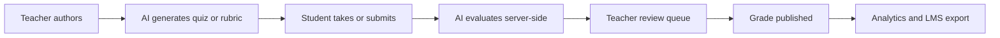

# Product Spec — AI-Powered Collaborative Learning and Assessment Platform

Source of truth for scope. If a feature is not in this document, it is not in the product.

## Origin and why this spec exists

The original dissertation ("AI-Powered Collaborative Learning and Assessment Platform",
Arockia Sachin A, VIT, M.Tech Big Data Analytics, April 2025) is two products stapled
together:

1. **Chapters 1-3.5 and the executive summary** — an AI-driven collaborative learning and
   assessment platform (LLM quiz generation, rubric grading of descriptive writing,
   sandboxed code evaluation, group formation, contribution tracking, intervention
   dashboards).
2. **Chapters 3.6-6, all references, and every reported result** — an unrelated
   NL2SQL / RAG / GraphWeaver business-intelligence assistant. The table of contents
   literally switches to "Challenges with Traditional BI Tools", "NL2SQL", and
   "GraphWeaver".

The prior codebase implemented the education half's _shell_ (gradebook, assessment CRUD,
enrollment) with **none** of its AI core, plus schema drift imported from the BI half
(`ExternalReference`, `noSqlRefId` on five models, an admin "datasets" browser).

**This product is the education half only.** The BI half is out of scope permanently.

## The one promise

> Teachers get LLM-assisted generation and grading of assessments without ever
> surrendering grading authority, and group projects get fair per-student assessment.

Everything below serves that sentence.

## Users

| Role    | Primary job                                                             |
| ------- | ----------------------------------------------------------------------- |
| Teacher | Author assessments, grade with AI assistance, monitor cohort, intervene |
| Student | Take quizzes, submit work, receive feedback, work in groups             |
| Admin   | Manage courses, sections, offerings, enrollments, and integrations      |

## The end-to-end spine

Phase 2 is not complete until this whole path works for one real course.

## Non-negotiable product rules

1. **Teacher approves every grade.** AI produces suggestions only. No grade is published
   without an explicit human action.
2. **Grading is server-authoritative.** Correct answers, answer keys, and rubric internals
   never reach the client.
3. **The rubric is the binding contract.** The model cannot score outside teacher-defined
   criteria or exceed the rubric's point ceiling.
4. **Every AI score is explainable.** Each carries a rationale, quoted evidence,
   a confidence value, the model, the prompt version, and latency.
5. **Overrides are calibration data.** Teacher corrections are stored and used to steer
   later batches without retraining.
6. **Signed sessions only.** No plaintext or unsigned session material anywhere.
7. **No secrets in the repo.**

## In scope for the first release

### 1. Quiz generation

Teacher supplies a topic or lesson description; the system retrieves relevant course
material and generates multiple-choice questions with credible distractors, tagged by
subtopic and difficulty. Teacher reviews and edits before publishing.

Acceptance criteria

- Given a course with indexed material, generating N questions returns N items, each with
  4-5 options, exactly one correct answer, a subtopic tag, and a difficulty value.
- Distractors target plausible misconceptions rather than obvious throwaways.
- Generated questions are drafts until the teacher publishes them.

### 2. Quiz grading

Automatic scoring on submission. Optional partial credit for short-answer rationales
scored against a reference explanation by similarity threshold.

Acceptance criteria

- Multiple-choice scoring is exact and computed server-side.
- Partial credit requires an explicitly configured threshold and reference explanation.
- Students receive per-question correctness, their answer, the correct answer, and an
  explanation.
- Results update the teacher dashboard with per-question metrics.

### 3. Descriptive grading against rubrics

Teacher defines a weighted rubric (criteria, levels, descriptors, point values). The model
scores each criterion, quotes evidence from the student's work, and produces per-criterion
feedback. Submissions land in a review queue; the teacher accepts, edits, or overrides.
Override reasons are recorded and used for calibration.

Acceptance criteria

- Scores are produced per criterion, never as a single opaque number.
- Each criterion score cites the student text it is based on.
- Low-confidence and statistical-outlier submissions are flagged for review.
- Nothing publishes before teacher sign-off.
- Teacher overrides are stored with reason and influence later batches.
- A second-marker sampling workflow exists for quality assurance.

### 4. Code and debugging evaluation

Sandboxed execution of student code against test cases, with generated tests, coverage,
code-quality signals, and cohort similarity detection. Never executed on the app host.

Acceptance criteria

- Student code runs in an isolated environment with no network and enforced CPU/memory/time
  limits.
- Results report per-test pass/fail with output, not a bare score.
- Test categories cover unit, input/output, code quality, and structure.
- Resubmission is allowed until the deadline, with limits to prevent test brute-forcing.
- Cohort similarity checks flag suspiciously similar submissions for human review.

### 5. Collaborative projects

Instructor-weighted team formation that maximizes the worst-fitting team and respects
schedule constraints. Confidential peer evaluation across five behaviourally-anchored
dimensions, with self and non-self adjustment factors converting a group grade into
individual grades. Contribution events and milestones give secondary evidence.

Acceptance criteria

- Formation criteria and weights are instructor-controlled and visible in the output.
- Peer evaluation is confidential; students cannot see who said what.
- Adjustment factors are computed with and without self-ratings.
- Free-riders and struggling teams are surfaced to the instructor.
- Contribution metrics are presented as evidence, never as the sole basis for a grade.

### 6. Analytics and intervention

Item analysis (difficulty and discrimination index), distribution views, alerts when the
class average drops below a threshold, imbalance detection, and dashboard visibility into
unanswered review queues.

Acceptance criteria

- Per-question difficulty and discrimination indices are computed from real attempts.
- Alerts fire on configurable thresholds and are visible to the owning teacher.
- Adaptive retake can target the specific questions a student failed.

### 7. Grade export and LMS interoperability

Weighted final grade from configurable category weights. Export starts as OneRoster-shaped
CSV, then becomes real LTI 1.3 with Assignment and Grade Services.

Acceptance criteria

- Category weights are configurable and sum-checked.
- CSV export conforms to OneRoster 1.2 gradebook shape (line items, results, score scales).
- LTI AGS integration creates line items and posts scores only after teacher approval.

## Explicitly out of scope

- The entire BI / NL2SQL / RAG / GraphWeaver half of the report, and all its reported
  metrics.
- Presentation assessment and Whisper transcription (deferred by decision).
- Schema with no use case: attendance, streams, student course ratings, grade history,
  `ExternalReference`, `noSqlRefId`, `legacyPassword`.

## Open questions to resolve during Phase 1

- Which LLM provider and model is default for each task (generation vs. grading)?
- Retention policy for student work, AI rationales, and evidence quotes.
- Whether partial credit for short answers is on by default or opt-in per assessment.
- Which sandbox backend for code execution, and where it is hosted.
